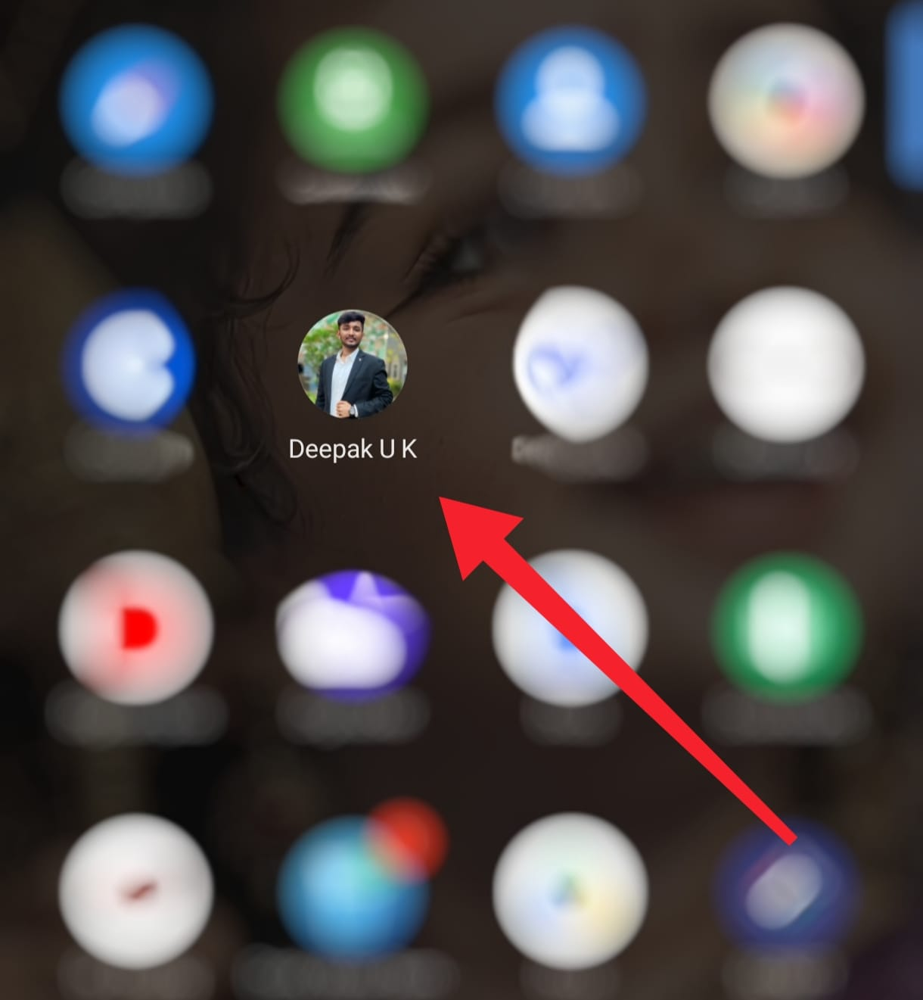
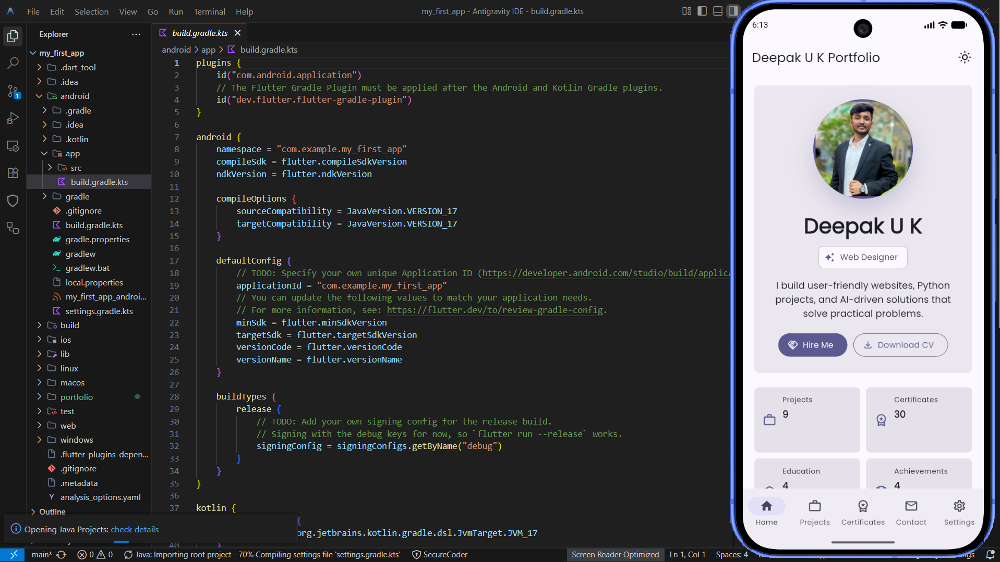
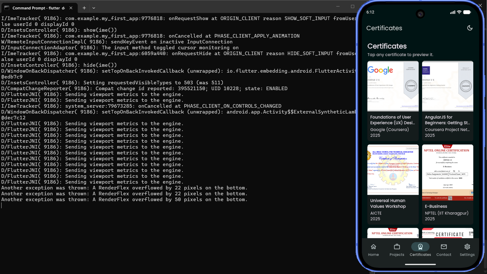
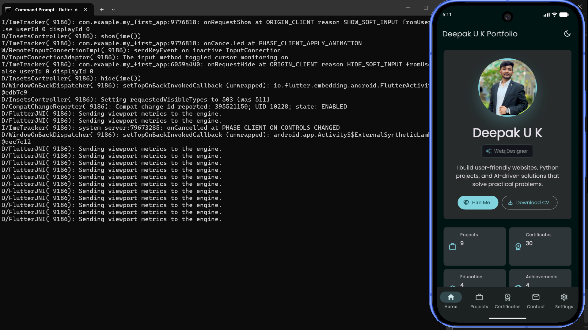

## 📥 Download & Install APK

### Step 1: Download the APK

Download the latest APK from the GitHub Release page:

🔗 Release Link:
https://github.com/DeepakUK17/Portfolio_Mobile_App_Flutter/releases/tag/v1.0.0

### Step 2: Install on Android

1. Download `app-release.apk`
2. Open the APK file on your Android device
3. Allow installation from unknown sources if prompted
4. Complete the installation
5. Launch **Deepak Portfolio App**

### Step 3: Explore the Application

After installation, users can:

* View my professional profile
* Explore technical skills
* Browse project showcases
* View certifications and achievements
* Access contact information
* Experience the mobile portfolio interface

---

## 📸 Application Preview

### Home Screen

### Projects Section

### Certificates Section

### Contact & Settings

---

## 🔗 Source Code Repository

GitHub Repository:

https://github.com/DeepakUK17/Portfolio_Mobile_App_Flutter

---

## ⚙️ Run Locally

Clone the repository:

git clone https://github.com/DeepakUK17/Portfolio_Mobile_App_Flutter.git

Navigate to the project directory:

cd Portfolio_Mobile_App_Flutter

Install dependencies:

flutter pub get

Run the application:

flutter run
